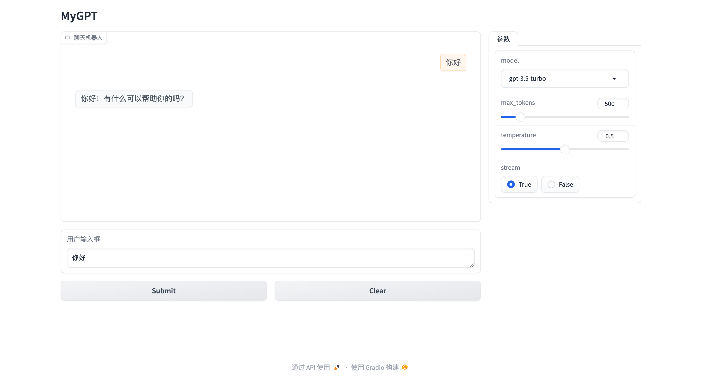
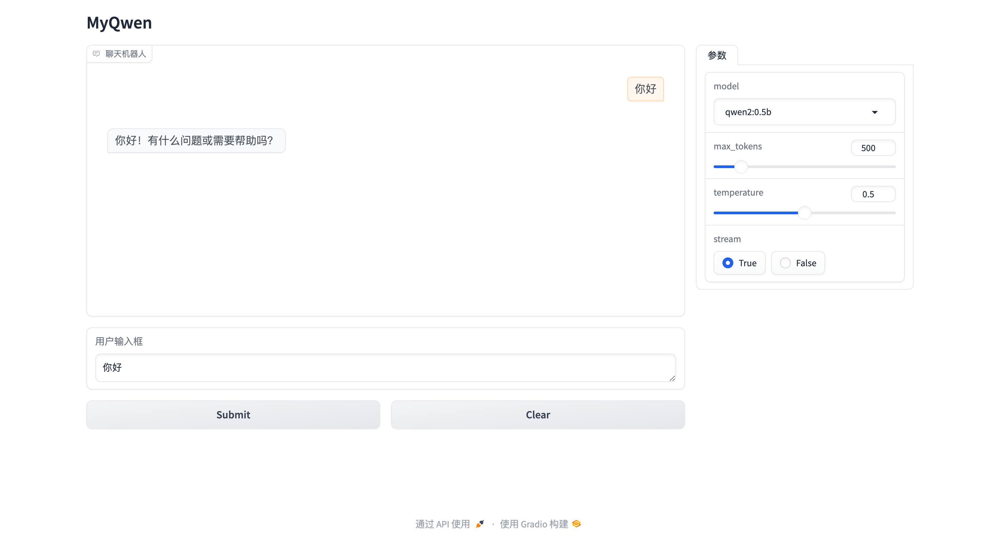
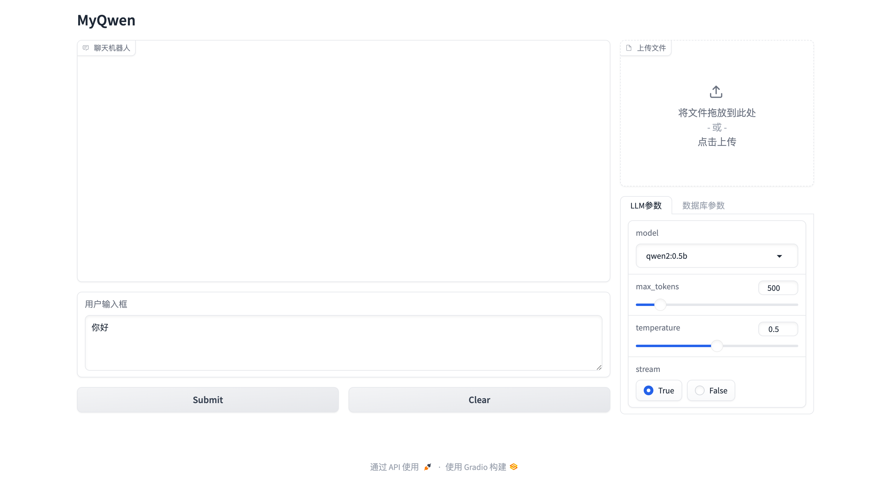

# ChatBot_Gradio

基于Gradio的网页端chatbot项目

持续更新中...
## 版本介绍
- 版本一：基础版本 使用openai的key进行简单对话 
  - 
  - Latency：3.4s
  - 缺点：受限于网络条件，数据联网存在数据泄露的风险，api按照token进行收费
  - 优点：可以使用openai，API进行推理，对本地算力无要求
- 版本二：使用本地llm进行简单对话
  - 
  - Latency：0.2s
  - 缺点：需要本地部署llm，需要本地算力
  - 优点：使用本地llm，推理速度超快
- 版本三：连接数据库构建RAG_chatbot 
  - 
  - 数据库未接入，待更新
## 文件介绍
MyGPT.py: 用于构建模型，并调用模型进行推理
web.py: 用于构建网页，并调用模型进行推理
config.py: 配置文件，包括模型路径、tokenizer路径等
.env: 配置文件，包括openai的api key等 （注意：请勿将此文件上传至github）

## 使用方法
1. 安装依赖包
2. 配置config.py中的参数
3. 运行web.py